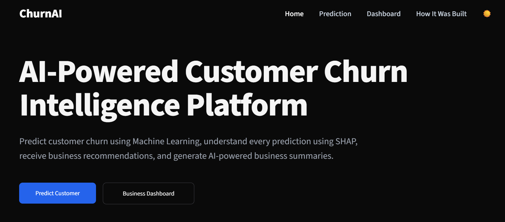

# 📊 Customer Churn Prediction System

An end-to-end Machine Learning project that predicts whether a telecom customer is likely to churn. The system leverages a **Threshold-Optimized Logistic Regression** model along with **SHAP (SHapley Additive exPlanations)** to provide transparent and interpretable predictions. A Streamlit-based web application allows users to input customer details and receive churn predictions with business-friendly explanations, retention recommendations, and a full interactive business dashboard.

## 🚀 Live Demo

🔗 **[Try the Live Demo](https://your-app-url.streamlit.app)**

## 📸 Dashboard Preview



---

## 🚀 Features

- Predict customer churn probability with risk level
- Threshold-optimized Logistic Regression model, chosen after comparing 4 algorithms across multiple optimization strategies
- Automated preprocessing using a Scikit-learn Pipeline
- Explainable AI with SHAP — per-prediction risk and protective factors
- Business-friendly, personalized retention recommendations
- Interactive business Dashboard (Plotly) — churn drivers, geographic hotspots, CLTV impact
- "How It Was Built" page — full model comparison table with filters, dataset preview, and the reasoning behind the final model
- Dark / light theme toggle
- Streamlit-based interactive multi-page web application
- Model serialization with Joblib

---

## 🛠️ Tech Stack

### Programming Language
- Python

### Machine Learning
- Scikit-learn
- Logistic Regression, Decision Tree, Random Forest
- XGBoost
- SHAP (explainability)
- imbalanced-learn (SMOTE / SMOTEENN for class imbalance handling)

### Data Processing
- Pandas
- NumPy

### Data Visualization
- Plotly (in-app interactive charts)
- Matplotlib / Seaborn (exploratory analysis in notebooks)

### Web Framework
- Streamlit

### Model Serialization
- Joblib

### Development Tools
- Jupyter Notebook
- VS Code
- Git & GitHub

---

## 📂 Project Structure

```text
customer-churn-prediction/
│
├── 📂 .streamlit/              # Streamlit configuration
│   └── 📄 config.toml
│
├── 📂 data/                    # Public Kaggle dataset
│
├── 📂 model/                   # Trained ML pipeline & serialized artifacts
│
├── 📂 notebooks/               # EDA, preprocessing & model development
│
├── 📂 pages/                   # Streamlit application pages
│
├── 📂 utils/                   # Prediction, SHAP & helper modules
│
├── 📄 app.py                   # Streamlit entry point
├── 📄 theme.py                 # Shared UI theme, navbar & loading screen
├── 📄 requirements.txt         # Project dependencies
├── 📄 README.md                # Project documentation
└── 📄 .gitignore               # Git ignore rules
```
---

## 📊 Dataset

The project uses the **IBM Telco Customer Churn Dataset**, a publicly available dataset containing customer demographics, subscribed services, billing information, and churn status. It's included directly in this repo under `data/` since it's public — no proprietary or customer data is used. The cleaned/engineered training set and exact preprocessing pipeline used to train the model are kept private.

**Target Variable**
- Churn Label (Yes / No)

---

## 🖥️ Application Pages

- **Home** — project overview and how a prediction flows end to end
- **Prediction** — customer intake form, live churn prediction with SHAP-explained risk factors and recommendations
- **Dashboard** — business-facing analytics: churn by contract/tenure/payment method, geographic hotspots, CLTV impact
- **How It Was Built** — full model comparison across every algorithm and optimization strategy tested, a scrollable dataset preview, and the reasoning behind the final model choice

---

## 🔄 Project Workflow

```text
Customer Data
│
▼
Data Cleaning
│
▼
Exploratory Data Analysis
│
▼
Feature Engineering
│
▼
Train-Test Split
│
▼
Model Training
│
▼
Hyperparameter Tuning
│
▼
Class Imbalance Handling (SMOTE / SMOTEENN)
│
▼
Threshold Optimization
│
▼
Pipeline Creation
│
▼
SHAP Explainability
│
▼
Streamlit Deployment
```
---

## 🤖 Models Evaluated

The following machine learning models were trained and evaluated:

- Logistic Regression
- Decision Tree
- Random Forest
- XGBoost

Each model was assessed using:

- Baseline Performance
- Hyperparameter Tuning
- SMOTE
- SMOTEENN
- Threshold Optimization

The full comparison table across every run is available on the app's **How It Was Built** page.

---

## 🏆 Final Model

**Threshold-Optimized Logistic Regression**

### Performance

| Metric | Score |
|---------|-------|
| Accuracy | **80.03%** |
| Precision | **61.77%** |
| Recall | **65.24%** |
| F1-Score | **63.46%** |
| ROC-AUC | **84.43%** |

### Why Logistic Regression?

Multiple machine learning models, including Logistic Regression, Decision Tree, Random Forest, and XGBoost, were evaluated using baseline training, hyperparameter tuning, resampling techniques (SMOTE/SMOTEENN), and threshold optimization.

Although Threshold-Optimized XGBoost achieved a slightly higher F1-score, the improvement was marginal. Threshold-Optimized Logistic Regression delivered the highest accuracy of every run tested, while offering superior interpretability, computational efficiency, and seamless integration with SHAP for explainable AI. These advantages made it the preferred choice for deployment.

---

## 📈 Explainable AI

The application uses **SHAP (SHapley Additive exPlanations)** to explain every prediction by highlighting:

- Features increasing churn risk
- Features reducing churn risk
- Individual feature contributions
- Business-friendly interpretation
- Personalized retention recommendations

---

## 🚀 Installation

Clone the repository:

```bash
git clone https://github.com/your-username/customer-churn-prediction.git
```

Navigate to the project directory:

```bash
cd customer-churn-prediction
```

Create a virtual environment (optional):

```bash
python -m venv venv
```

Activate the environment

**Windows**

```bash
venv\Scripts\activate
```

**Linux/macOS**

```bash
source venv/bin/activate
```

Install dependencies:

```bash
pip install -r requirements.txt
```

Run the application:

```bash
streamlit run app.py
```

The app will automatically open in your browser, or visit:
http://localhost:8501

---

## 📌 Future Improvements

- Batch customer prediction (CSV upload → bulk scoring)
- AI-generated executive summaries per prediction
- REST API support
- Model monitoring and retraining
- Authentication system

---

## 📄 License

This project is intended for educational and portfolio purposes.

---

## 👨‍💻 Author

**Dilnaz Kaur Grewal**

B.Tech Computer Science & Engineering
Guru Nanak Dev Engineering College

---

⭐ If you found this project useful, consider giving it a star!